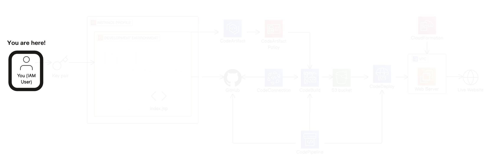
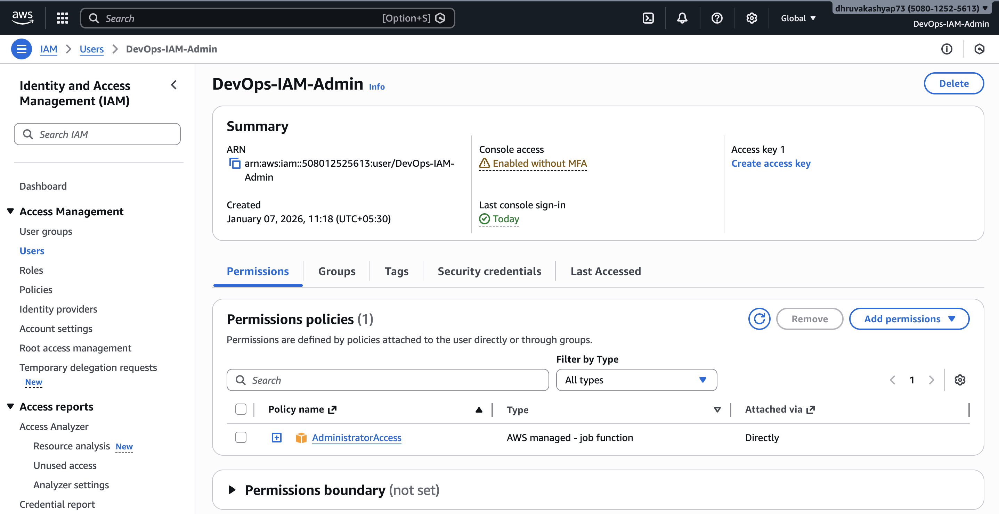
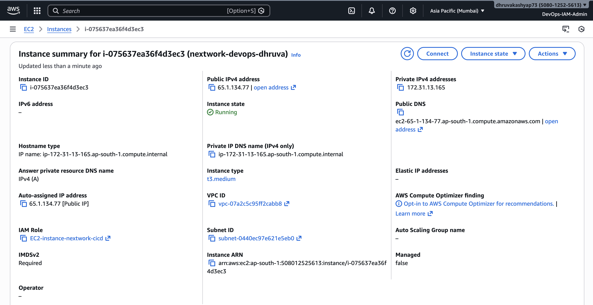
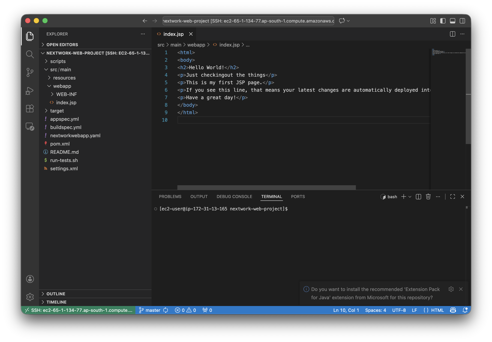

# Chapter 1: Set Up a Cloud Development Environment (EC2)

**Difficulty:** Beginner | **AWS Service:** EC2 | **Tools:** Maven, Java

---

## Aim / Goal

The goal of this chapter is to establish a complete cloud-based development environment using Amazon EC2. This environment serves as the foundation for building and managing a Java web application entirely on the cloud, preparing the infrastructure for the subsequent CI/CD pipeline implementation.

---

## Architecture (Chapter-Specific Diagram)

This chapter focuses on setting up the foundational development infrastructure. The local development machine connects securely to an EC2 instance via SSH, where Apache Maven and Java are installed to enable building and generating the Java web application structure.



---

## Prerequisites

As this is Chapter 1, no prior chapter setup is required. However, ensure the following are available to proceed:

- AWS account with management access
- Administrative capability to create IAM users and EC2 instances
- Mac with internet connectivity (macOS 10.12 or later)
- Ability to download and manage files (.pem key files)
- Administrator access on Mac for installing software

---

## Tech Stack Used

| Component | Version/Details |
|-----------|-----------------|
| AWS IAM | IAM Admin User with AdministratorAccess |
| Amazon EC2 | Amazon Linux 2023 AMI |
| Instance Type | t2.micro (eligible for free tier) |
| Connectivity Protocol | SSH (Secure Shell) on Port 22 |
| Code Editor | Visual Studio Code (macOS) |
| Remote Extension | Remote - SSH Extension for VS Code |
| Build Tool | Apache Maven 3.5.2 |
| Java Runtime | Amazon Corretto 8 (JDK 1.8.0) |
| Terminal Editor | Nano |

---

## Step-by-Step Implementation

### Step 1: Create and Configure IAM User

AWS recommends using IAM users instead of the root account for everyday tasks. This step establishes a dedicated IAM user with administrative permissions for this project.

**Procedure:**
1. Log into AWS Management Console as the root user
2. Navigate to IAM console and select Users from the left panel
3. Click Create user and enter username: `IAM-Admin`
4. Enable console access and set a custom password
5. Deselect the option requiring password change at next sign-in
6. Attach the AdministratorAccess policy directly
7. Download the .csv file containing login credentials
8. Copy and store the Console sign-in URL
9. Log out from root user and log in using the new IAM user credentials



---

### Step 2: Launch EC2 Instance

The EC2 instance serves as the cloud-based development and application server. This step creates and configures the virtual machine.

**Procedure:**
1. Navigate to EC2 console in AWS Management Console
2. Select Instances and click Launch instances
3. Configure the following settings:
   - **Name:** nextwork-devops-
   - **AMI:** Amazon Linux 2023
   - **Instance Type:** t2.micro
4. Create a new key pair:
   - **Name:** nextwork-keypair
   - **Type:** RSA
   - **Format:** .pem
5. In Network settings, set Allow SSH traffic from to My IP (or Custom with your specific IP/32)
6. Review and launch the instance

**Important Note:** Immediately download and secure the .pem file. This file is your private key and cannot be recovered after creation.



---

### Step 3: Store and Secure the Key Pair

Proper key pair management is critical for security. This step ensures your private key has appropriate permissions.

**Procedure:**
1. Create a folder on your desktop named `DevOps`
2. Move the downloaded `nextwork-keypair.pem` file into `~/Desktop/DevOps/`
3. Open VS Code terminal and navigate to the folder:
   ```bash
   cd ~/Desktop/DevOps
   ls
   ```
4. Set restricted permissions on the key file:
   ```bash
   chmod 400 nextwork-keypair.pem
   ```

**Troubleshooting:**
- **Error: Permission denied (publickey)** - Verify chmod permissions are correctly set and the filename matches exactly
- **Connection refused** - Confirm the EC2 instance is in running state and the security group allows SSH from your IP address

---

### Step 4: Connect to EC2 Instance via SSH

SSH provides a secure encrypted connection to the remote EC2 instance, allowing command execution from your local terminal.

**Procedure:**
1. In AWS Console, select your EC2 instance and note the Public IPv4 DNS (example: ec2-13-239-113-205.ap-southeast-2.compute.amazonaws.com)
2. In VS Code terminal, execute:
   ```bash
   ssh -i ~/Desktop/DevOps/nextwork-keypair.pem ec2-user@<YOUR_PUBLIC_IPV4_DNS>
   ```
   Example: `ssh -i ~/Desktop/DevOps/nextwork-keypair.pem ec2-user@ec2-13-239-113-205.ap-southeast-2.compute.amazonaws.com`
3. When prompted about connecting to an unknown host, type `yes` to continue
4. The terminal prompt should change to display `ec2-user@<IPv4_DNS>:~$` confirming successful connection

**Verification:** The terminal prefix changes from your local machine name to the EC2 instance identifier.

---

### Step 5: Install Apache Maven

Apache Maven is a build automation and dependency management tool essential for Java web application development. Maven also provides archetypes (project templates) that accelerate project setup.

**Procedure:**
1. From the SSH-connected terminal, execute:
   ```bash
   wget https://archive.apache.org/dist/maven/maven-3/3.5.2/binaries/apache-maven-3.5.2-bin.tar.gz
   sudo tar -xzf apache-maven-3.5.2-bin.tar.gz -C /opt
   echo "export PATH=/opt/apache-maven-3.5.2/bin:$PATH" >> ~/.bashrc
   source ~/.bashrc
   ```

**If wget is not available:**
```bash
sudo yum install wget -y
```
Then re-execute the Maven installation commands.

**Expected Duration:** 30-45 seconds for download and extraction


---

### Step 6: Install Amazon Corretto 8 (Java)

Amazon Corretto 8 is a free, open-source Java Development Kit required for Maven and Java web application execution.

**Procedure:**
1. Execute the following commands:
   ```bash
   sudo dnf install -y java-1.8.0-amazon-corretto-devel
   export JAVA_HOME=/usr/lib/jvm/java-1.8.0-amazon-corretto.x86_64
   export PATH=/usr/lib/jvm/java-1.8.0-amazon-corretto.x86_64/jre/bin/:$PATH
   ```
2. The terminal will display installation progress and verification output

**Java Version Management:**
If multiple Java versions exist, select the correct one with:
```bash
sudo alternatives --config java
```

---

### Step 7: Verify Maven and Java Installation

Verification ensures both tools are correctly installed and accessible from any directory.

**Procedure:**
1. Check Maven version:
   ```bash
   mvn -v
   ```
   Expected output includes Apache Maven version 3.5.2 and Java version.

2. Check Java version:
   ```bash
   java -version
   ```
   Expected output should display openjdk version 1.8.0.

**Troubleshooting:**
- **mvn command not found** - Re-run the Maven installation commands and source ~/.bashrc
- **Java version mismatch** - Use `sudo alternatives --config java` to select Java 1.8.0

---

### Step 8: Generate Java Web Application

Maven's archetype generator creates a standardized web application project structure, eliminating manual setup of directories and configuration files.

**Procedure:**
1. Execute the following command:
   ```bash
   mvn archetype:generate \
      -DgroupId=com.nextwork.app \
      -DartifactId=nextwork-web-project \
      -DarchetypeArtifactId=maven-archetype-webapp \
      -DinteractiveMode=false
   ```

2. Maven will download dependencies and generate the project structure. This process takes 1-2 minutes.

3. Look for `BUILD SUCCESS` message at the end of the output. This confirms successful project generation.

**Project Structure Created:**
- `src/main/webapp/` - Web application files (HTML, JSP)
- `src/main/resources/` - Configuration files
- `pom.xml` - Maven Project Object Model configuration

---

### Step 9: Install VS Code Remote-SSH Extension

The Remote-SSH extension allows VS Code to directly connect to the EC2 instance, providing full IDE features (syntax highlighting, file navigation, integrated editing) on remote files.

**Procedure:**
1. On your local machine, open VS Code
2. Click the Extensions icon in the left sidebar
3. Search for "Remote - SSH" by Microsoft
4. Click Install

**Post-Installation Setup:**
1. Click the Remote explorer button (double arrows) at the bottom left of VS Code
2. Select "Connect to Host..."
3. Select "+ Add New SSH Host..."
4. Enter the SSH command:
   ```bash
   ssh -i ~/Desktop/DevOps/nextwork-keypair.pem ec2-user@<YOUR_PUBLIC_IPV4_DNS>
   ```
5. Select the SSH config file location (typically `~/.ssh/config`)
6. The "Host added!" popup confirms successful configuration



---

### Step 10: Open Project in Remote VS Code

Once connected, VS Code can access and edit files directly on the EC2 instance.

**Procedure:**
1. From the Remote explorer (bottom left), select your EC2 instance and click Connect
2. A new VS Code window opens connected to the EC2 instance
3. Click the Explorer icon (file icon) in the left sidebar
4. Click "Open Folder"
5. Enter the path: `/home/ec2-user/nextwork-web-project`
6. Click OK
7. If prompted about trusting the folder, click "Yes, I trust the authors"

**Verification:** The file explorer displays the project structure with folders including src/, target/, and files like pom.xml and index.jsp.

---

### Step 11: Edit index.jsp via VS Code IDE

The index.jsp file is the entry point of the web application. This step demonstrates using VS Code's IDE features to edit application code.

**Procedure:**
1. In the file explorer, expand src/ → main/ → webapp/
2. Click index.jsp to open it in the editor
3. Replace the entire file content with:
   ```html
   <html>
   <body>
   <h2>Hello !</h2>
   <p>This is my NextWork web application working!</p>
   </body>
   </html>
   ```
4. Save the file using Ctrl+S (Windows/Linux) or Cmd+S (macOS)

**Verification:** The file tab shows no dot indicator after saving, confirming changes are persisted.


---

### Step 12: Edit index.jsp via Terminal (Nano)

This step demonstrates editing files directly through the terminal using the nano editor, which is useful when IDE access is unavailable.

**Procedure:**
1. Switch from the Remote-SSH VS Code window to your original local VS Code window
2. Ensure your terminal still shows the SSH connection (prompt displays `ec2-user@...`)
3. If disconnected, re-run the SSH command from your DevOps folder
4. Navigate to the webapp directory:
   ```bash
   cd ~/nextwork-web-project/src/main/webapp
   ```
5. Open the file in nano:
   ```bash
   nano index.jsp
   ```
6. Using keyboard navigation, find the line containing `<p>This is my NextWork web application working!</p>`
7. Move to the end of that line and press Enter to create a new line
8. Type:
   ```html
   <p>I am writing this line using nano instead of an IDE.</p>
   ```
9. Save by pressing Ctrl+S, then exit by pressing Ctrl+X

   **Mac Keyboard Note:** On Mac keyboards, use the Control (Ctrl) key directly—there is no special mapping needed.

**Verification:** Return to the Remote-SSH VS Code window and refresh (or check the file) to see the updated content. Both the local terminal and VS Code should display the same file content, confirming real-time synchronization.

---

## Outputs

Upon completion of this chapter, the following outputs are achieved:

**Infrastructure Setup:**
- Functional EC2 instance running Amazon Linux 2023 with public IP address
- Secure SSH connectivity from Mac to EC2 instance
- Key pair (.pem) file securely stored with appropriate permissions

**Development Environment:**
- VS Code installed locally with Remote-SSH extension configured
- Remote development connection established to EC2 instance
- Terminal access via SSH providing command-line interface to EC2 instance

**Build Tools:**
- Apache Maven 3.5.2 installed and verified (mvn -v output visible)
- Amazon Corretto 8 Java Runtime installed and verified (java -version output visible)
- Environment variables configured for tool accessibility from any directory

**Application Artifact:**
- Java web application project structure generated successfully
- Project naming: nextwork-web-project with correct groupId (com.nextwork.app)
- index.jsp file created and edited via both VS Code IDE and nano terminal editor
- BUILD SUCCESS confirmation from Maven archetype generation

**Documentation:**
- Screenshots capturing key milestones (EC2 instance creation, SSH connection, VS Code connection)
- Command outputs demonstrating successful tool installations
- Updated application code showing modifications made via both IDE and terminal

---

## Key Technical Concepts Covered

1. **IAM User Management** - Created non-root administrative user following AWS security best practices
2. **EC2 Instance Configuration** - Launched and configured virtual machine with appropriate AMI, instance type, and security settings
3. **SSH Key Pair Management** - Generated, secured, and applied private key with correct file permissions
4. **SSH Protocol** - Established encrypted secure connection to remote server using public key cryptography
5. **Package Management** - Installed and configured Apache Maven for Java project automation
6. **Java Runtime** - Installed Java Development Kit (Corretto 8) enabling Java code compilation and execution
7. **IDE Remote Development** - Configured VS Code to connect to and edit files on remote EC2 instance
8. **Terminal-Based File Editing** - Used nano text editor to edit files directly via SSH terminal connection
9. **Maven Archetypes** - Generated standardized project structure from Maven templates

---

## Navigation

| Previous | Current | Next |
|----------|---------|------|
| — | **Chapter 1: EC2 Setup** | Chapter 2: Connecting GitHub |

---

## Important Notes

- Always use IAM users instead of root account for security best practices and auditability
- Store the .pem file securely and never commit it to version control systems
- The .pem file cannot be recovered after creation; maintain a secure backup
- Ensure your current IP address is allowed in the security group SSH rule
- Monitor AWS account for running instances to avoid unexpected charges
- If IP address changes, update the EC2 security group inbound rule for continued SSH access

---

## Full Project Documentation

Complete project documentation with detailed instructions, screenshots, and troubleshooting guides:

[Day 1 DevOps Setup - Complete Documentation (PDF)](Resources/Day1-DevOps.pdf)

---

**Last Updated:** January 19, 2026  
**Chapter Status:** Complete  
**Difficulty Level:** Beginner
