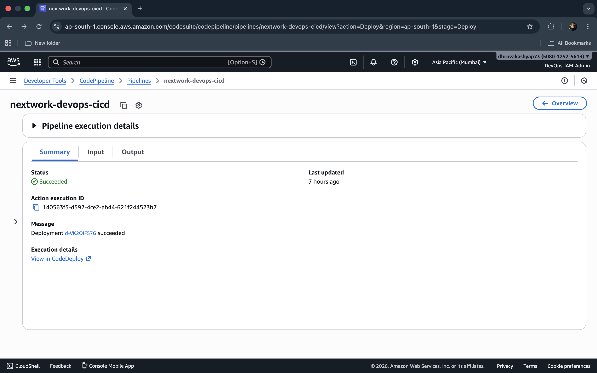
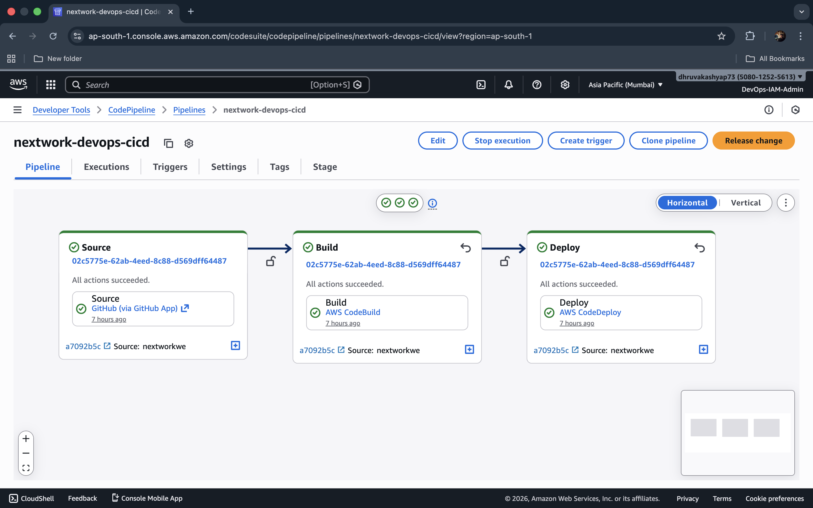
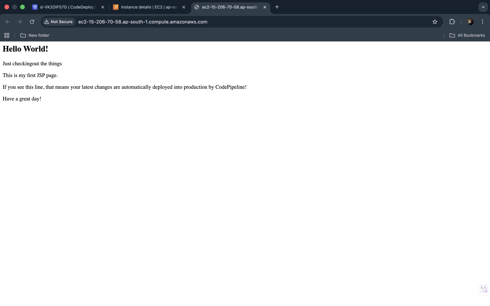

# DevStream: Cloud-native, End-to-End CI/CD

## Overview
**DevStream** is a cloud-native, end-to-end CI/CD project built using AWS DevOps services. It demonstrates the complete lifecycle of a web application from cloud-based development setup to automated build, deployment, infrastructure provisioning, and continuous delivery using a fully orchestrated pipeline.

This project is divided into **7 structured parts**, where each part focuses on one critical stage of CI/CD implementation and automation.

---

## Architecture Diagram

---

## Part 1: Set Up a Web App in the Cloud

### Objective
Set up a cloud-based development environment and generate a Java web application using Maven.

### Implementation
- Launched an **Amazon EC2 instance** to act as a cloud development server.
- Configured secure access using:
  - Key Pair authentication (`.pem`)
  - SSH connection through terminal and VS Code
- Installed required build tools:
  - Java 8 (Amazon Corretto)
  - Apache Maven
  - Git
- Generated a Maven-based Java web application using archetypes:
  - Created a standard Maven web application structure
  - Prepared the project for CI/CD integration
- Updated and verified the application UI:
  - Modified `index.jsp` to validate that the application structure and deployment output are correct

### Key Outputs
- EC2 development instance created and accessible via SSH
- Maven and Java environment configured successfully
- Web application generated and validated in the instance

To know more [Click Here](Documentation/Day1-DevOps.md)

---

## Part 2: Connect a GitHub Repo with AWS

### Objective
Connect the web application to GitHub for version control and enable remote repository tracking.

### Implementation
- Created a dedicated **GitHub repository** for the application codebase.
- Initialized Git inside the EC2-hosted project directory:
  - Enabled version tracking for all source files
- Connected the local repository to GitHub remote origin:
  - Configured remote URL for push and fetch operations
- Pushed application code into GitHub:
  - Staged files, committed changes, and pushed to the `master` branch
- Configured GitHub authentication securely using a **Personal Access Token (PAT)**:
  - Replaced password authentication with token-based access
  - Improved repository security and compatibility with automation workflows
- Verified repository sync:
  - Ensured all project files were visible and updated in GitHub

### Key Outputs
- GitHub repository linked successfully with the EC2 project directory
- Source code version history established and trackable
- PAT-based secure authentication enabled for future CI/CD stages

To know more [Click Here](Documentation/Day2-DevOps.md)

---

## Part 3: Store Dependencies in CodeArtifact

### Objective
Securely manage and consume project dependencies through a private artifact repository using AWS CodeArtifact.

### Implementation
- Created an **AWS CodeArtifact domain**:
  - Domain name: `nextwork`
- Created a **CodeArtifact repository**:
  - Repository name: `nextwork-devops-cicd`
  - Package format: Maven
- Enabled a public upstream repository:
  - Connected upstream to `maven-central-store`
  - Ensured Maven dependencies not found in CodeArtifact could still be retrieved securely
- Created and attached an IAM policy for CodeArtifact access:
  - Enabled permissions for:
    - Token retrieval
    - Repository endpoint access
    - Read access to repository packages
- Created an IAM role for the development EC2 instance:
  - Attached CodeArtifact consumer policy to this role
  - Associated the role with the EC2 instance
- Configured Maven authentication using `settings.xml`:
  - Added CodeArtifact repository endpoints
  - Used `CODEARTIFACT_AUTH_TOKEN` for secure access
- Verified CodeArtifact integration:
  - Ran Maven compile using the custom Maven settings configuration
  - Confirmed successful build and dependency resolution

### Key Outputs
- Private dependency storage established using CodeArtifact
- Maven authentication and dependency retrieval working correctly
- CodeArtifact enabled secure dependency management for the pipeline

To know more [Click Here](Documentation/Day3-DevOps.md)

---

## Part 4: Continuous Integration with CodeBuild

### Objective
Automate build and packaging of the Java web application using AWS CodeBuild.

### Implementation
- Created an S3 bucket for build artifacts:
  - Used for storing build outputs generated by CodeBuild
- Created an AWS CodeBuild project:
  - Source provider: GitHub
  - Repository: `nextwork-web-project`
  - Environment:
    - Managed Image: Amazon Linux 2
    - Runtime: Corretto 8
  - Output artifacts stored in S3 as ZIP
- Enabled logging:
  - Integrated CloudWatch Logs for build monitoring and debugging
- Updated CodeBuild IAM Role:
  - Attached CodeArtifact consumer policy
  - Ensured build environment could retrieve dependencies securely
- Created and added `buildspec.yml` in the repository root:
  - Exported CodeArtifact authentication token during build
  - Ran Maven build and packaging phases automatically
- Validated build execution:
  - Triggered manual build
  - Confirmed artifact generation in S3 bucket

### Key Outputs
- Automated CI build process implemented using CodeBuild
- Build artifacts packaged and stored consistently in S3
- Build logs enabled through CloudWatch for transparency

To know more [Click Here](Documentation/Day4-DevOps.md)

---

## Part 5: Deploy an App with CodeDeploy

### Objective
Automate application deployment to EC2 using AWS CodeDeploy.

### Implementation
- Provisioned deployment infrastructure using CloudFormation:
  - Created a dedicated stack for a deployment EC2 instance
  - Enabled required instance tags for deployment targeting
- Created a CodeDeploy application:
  - Compute platform: EC2/On-premises
- Created a deployment group:
  - Deployment type: In-place
  - Target selection:
    - EC2 instances with tag:
      - Key: `role`
      - Value: `webserver`
  - Deployment configuration:
    - Default (single-instance deployment strategy)
- Created CodeDeploy service role:
  - Attached AWS managed policy: `AWSCodeDeployRole`
- Executed deployment using build artifacts:
  - Retrieved build artifact S3 URI from the CodeBuild output bucket
  - Deployed the ZIP/WAR revision package into the EC2 environment
- Verified deployment:
  - Confirmed deployment status in CodeDeploy as successful
  - Validated the web application access through Public IPv4 DNS

### Key Outputs
- Automated deployment configured through CodeDeploy
- EC2 instance successfully received and deployed new application revisions
- Deployment workflow ready for pipeline orchestration

To know more [Click Here](Documentation/Day5-DevOps.md)

---

## Part 6: Automate Your Infrastructure with CloudFormation

### Objective
Convert the CI/CD infrastructure into reusable Infrastructure-as-Code using AWS CloudFormation.

### Implementation
- Used CloudFormation **IaC Generator** to scan AWS resources:
  - Identified CI/CD resources created in previous parts
- Generated an initial CloudFormation template containing key resources such as:
  - CodeArtifact domain and repositories
  - S3 artifact bucket
  - IAM roles and policies
  - CodeDeploy application
  - GitHub connection resource
- Resolved template deployment issues:
  - Fixed missing dependency ordering by using `DependsOn`
  - Eliminated circular dependencies by removing redundant policy references
- Enhanced the template manually by defining missing resources:
  - CodeBuild project definition
  - CodeDeploy deployment group definition
- Improved reusability with parameters:
  - GitHub repository owner
  - Repository name
- Validated template by deploying in a fresh stack:
  - Verified stack creation and resource provisioning
  - Confirmed key services were recreated successfully from the template

### Key Outputs
- Infrastructure fully reproducible using CloudFormation templates
- Manual fixes implemented to resolve dependency and ordering issues
- IaC template improved for reuse and portfolio demonstration

To know more [Click Here](Documentation/Day6-DevOps.md)

---

## Part 7: CI/CD with CodePipeline

### Objective
Build a fully automated CI/CD pipeline that connects GitHub, CodeBuild, and CodeDeploy into one continuous workflow.

### Implementation
- Created a CodePipeline pipeline:
  - Pipeline name: `nextwork-devops-cicd`
  - Execution mode: Superseded
  - Service role: auto-generated by CodePipeline
- Configured Source stage:
  - Provider: GitHub (via GitHub App)
  - Branch monitored: `master`
  - Enabled webhook trigger:
    - Automatically starts pipeline on code commits
- Configured Build stage:
  - Provider: AWS CodeBuild
  - Project selected: `nextwork-devops-cicd`
  - Build output passed to deploy stage as artifact
- Skipped Test stage:
  - Not required for this implementation
- Configured Deploy stage:
  - Provider: AWS CodeDeploy
  - Linked deployment group and application
  - Enabled rollback configuration on stage failure
- Verified automatic execution:
  - Pushed a new change to `index.jsp`
  - Observed new pipeline execution triggered automatically
- Verified deployment success:
  - Confirmed application changes reflected in the web server output
- Performed rollback validation:
  - Triggered rollback manually for deployment stage
  - Verified deployment reverted to previous stable version

### Key Outputs
- Fully automated CI/CD pipeline created using CodePipeline
- Webhook-based deployments achieved with no manual intervention
- Rollback capability tested successfully for reliability

To know more [Click Here](Documentation/Day7-DevOps.md)

---

## Final Outcome

### What Was Achieved
- Implemented a complete CI/CD workflow where:
  - Code changes pushed to GitHub automatically trigger pipeline execution
  - CodeBuild compiles and packages the application
  - Artifacts are stored in S3 and deployed using CodeDeploy
  - Deployments are automated and monitored through CodePipeline

### Final Results
- Fully automated end-to-end CI/CD pipeline successfully deployed on AWS
- Infrastructure reproducible through CloudFormation templates
- Dependency management secured using CodeArtifact
- Rollback procedures validated for production-level reliability

